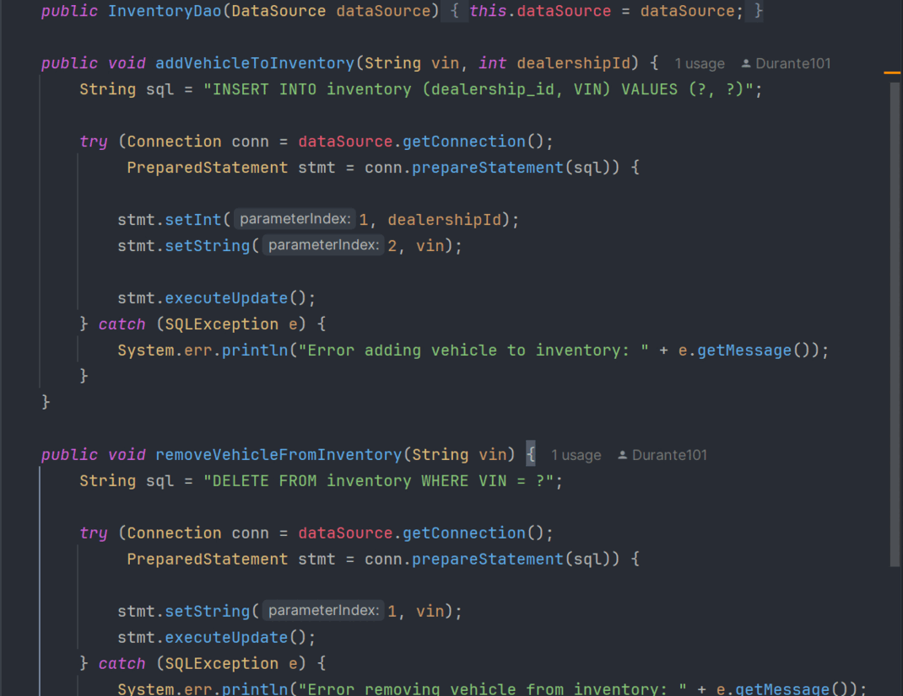

# Connecting your Car Dealership to a Database

## Description of the Project
This project is a system to help manage cars at a dealership. It lets you add, find, and remove vehicles, and keep track of sales and lease contracts in a database.

## Setup

Instructions on how to set up and run the project using IntelliJ IDEA.
I open IntelliJ and start a new Java project, then I name the project, right-click the src folder, and create a new Java class. I paste my code into that file. If I’m using a CSV file like transactions.csv, I make sure it’s in the project folder or fix the path in the code. After that, I just hit the green play button or right-click the file and run it—the app shows up in the terminal at the bottom.
### Prerequisites

- IntelliJ IDEA: Ensure you have IntelliJ IDEA installed, which you can download from [here](https://www.jetbrains.com/idea/download/).
- Java SDK: Make sure Java SDK is installed and configured in IntelliJ.

### Running the Application in IntelliJ

Follow these steps to get your application running within IntelliJ IDEA:

1. Open IntelliJ IDEA.
2. Select "Open" and navigate to the directory where you cloned or downloaded the project.
3. After the project opens, wait for IntelliJ to index the files and set up the project.
4. Find the main class with the `public static void main(String[] args)` method.
5. Right-click on the file and select 'Run 'YourMainClassName.main()'' to start the application.

## Technologies Used

- Java 17 Maven

## Demo

## Future Work
Having the option to look through multiple dealerships

## Resources

List resources such as tutorials, articles, or documentation that helped you during the project.

- [Java Programming Tutorial](https://www.example.com)
- [Effective Java](https://www.example.com)
- [Potato Sensei](https://chatgpt.com/g/g-681d378b0c90819197b16e49abe384ec-potato-sensei)
## Team Members

- **Durante Thorton 1** - Programmer.

## Thanks

Express gratitude towards those who provided help, guidance, or resources:

- Thank you to [Raymond] for continuous support and guidance.
- A special thanks to all teammates for their dedication and teamwork.
 